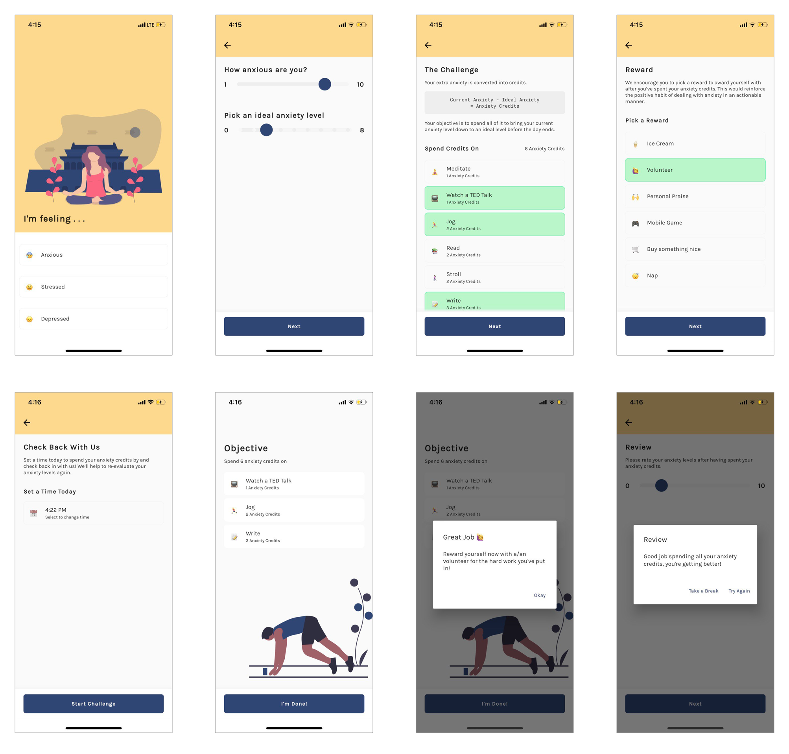

# Helm
Helm is an app that gamifies stress/anxiety/depression management in an actionable manner to provide relief.

To try it out, [setup flutter on your machine](https://flutter.dev/docs/get-started/install) and clone the project source.
```bash
# Clone project
git clone https://github.com/chuabingquan/helm.git

# For iOS deployment
cd helm/
rm -rf ios android/
flutter create .
flutter pub run flutter_launcher_icons:main
flutter run

# For Android Deployment
cd helm/
flutter run
```

## Context
As part of [NUS DSC's Hack For Good 2020](https://dsc.comp.nus.edu.sg/hackforgood2020), we developed Helm to address the problem statement of using technology to aid issues centered around stress/anxiety/depression. More info can be found in our [pitch deck](https://docs.google.com/presentation/d/1hH11FbyhlhNWxPFe0hKWraFyy2q5O0zYZZu8inYZYG8/edit?usp=sharing).

## How Does it Work?
- Helm quantifies the difference in a user's actual and ideal stress/anxiety/depression level as credits to be spent on a prescribed set of activities before the day ends. By doing so, users inadvertently take actionable steps to deal with their condition.

- Users then decide on the activities to spend their credits on, the reward they get for completing them (to positively reinforce the habit of taking actionable steps to deal with their condition), and a time for Helm to notify them to check back in.

- When users check back in, Helm prompts them to reward themselves, then proceeds to re-evaluate their stress/anxiety/depression levels.

- Should their stress/anxiety/depression levels be not up to mark, users get to re-attempt the challenge with their re-evaluated levels, restarting the whole process.

## Screenshots


## Credits
- [Mary Heng](https://github.com/maryheng)
- [Bing Quan](https://github.com/chuabingquan)